

Click the image above to watch a demo of the String Translator Desktop App on YouTube.

## Overview

String Translator Desktop App is a powerful desktop application built with Jetpack Compose, aiming to streamline the translation of strings for developers. It empowers users to seamlessly translate multiple strings into various languages, thereby optimizing the localization process.

## Features

- **Bulk Translation**: Translate multiple strings at once to target languages.
- **Language Selection**: Choose from a variety of supported languages for translation.
- **Jetpack Compose UI**: Enjoy an intuitive and visually appealing interface built with Jetpack Compose.
- **Translation with Google Translate**: Effortlessly translate your text using Google Translate without the need for an API key.
- **Export to XML Format**: Export translated strings to XML for seamless integration into your projects.

## Getting Started

### How to Build and Run the App 🛠️

1. Clone the repository: `https://github.com/Coding-Meet/String-Translator-App.git`
2. Navigate to the project directory: `cd String-Translator-App`
3. Build the project: `./gradlew build`
4. Run the application: `./gradlew run`

## Working 💻

1. **Launch the application.**

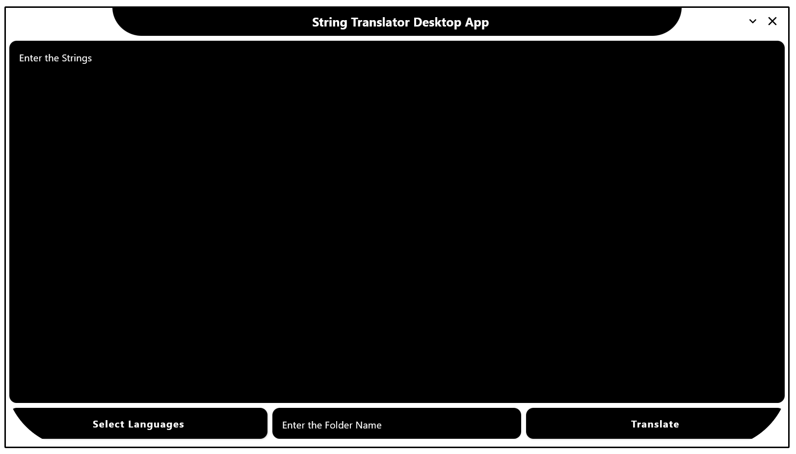

2. **Enter the source strings in XML format into the provided text field.**

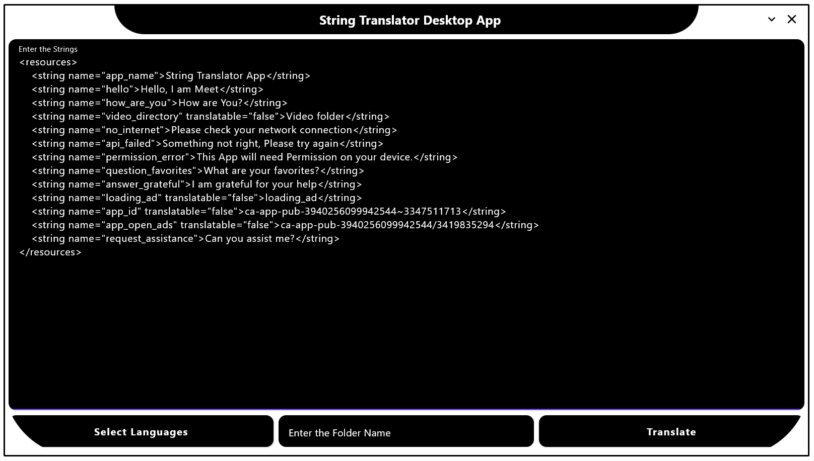

3. **Select the target languages.**

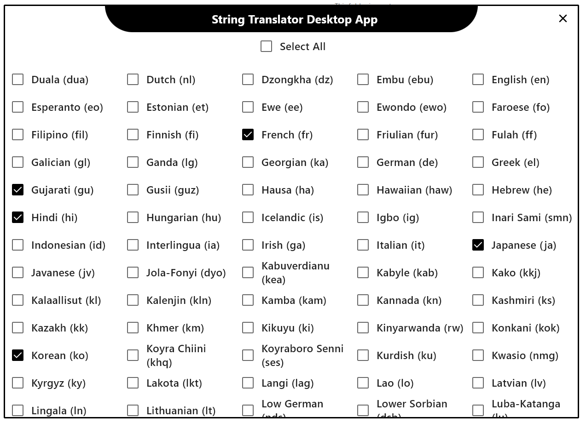

4. **Enter the folder name where you want to store the translated strings.**

5. **Click "Translate" to initiate the translation process.**

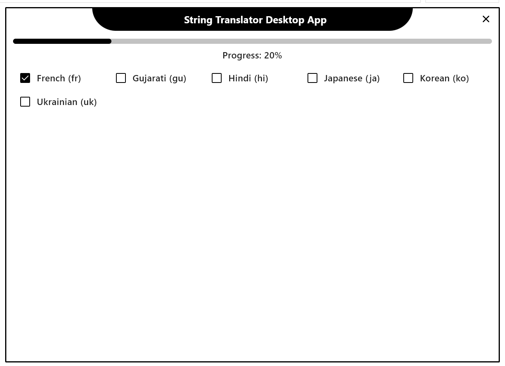

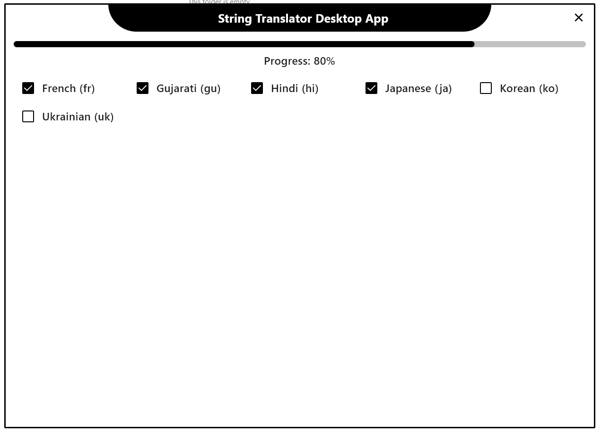

6. **Click "Done".**

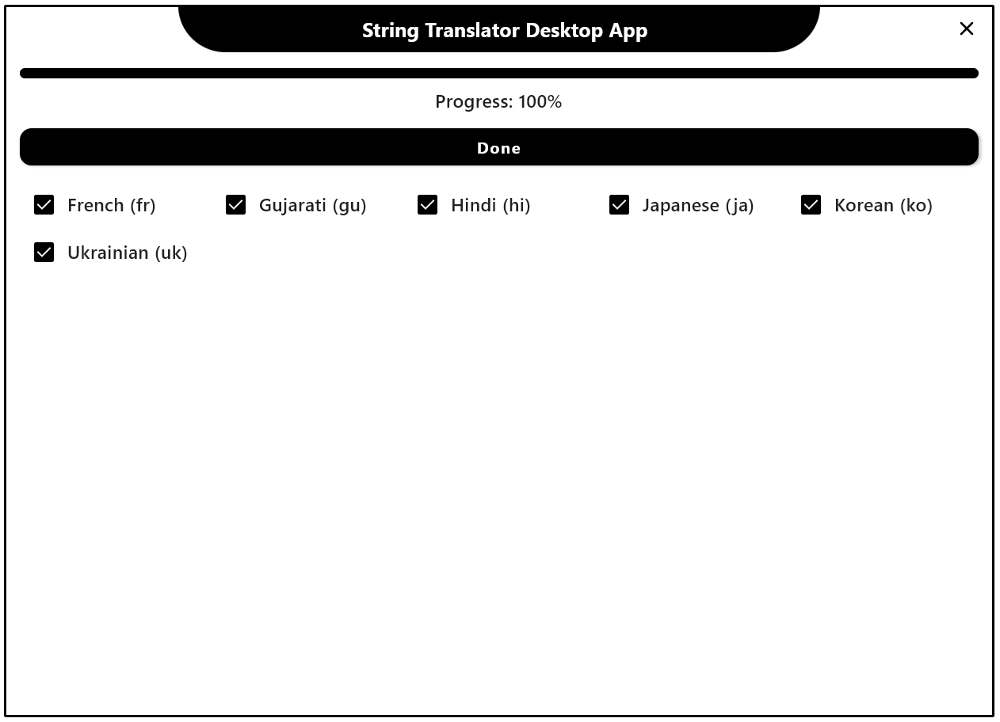

7. **"All strings have been successfully translated" message shown.**

8. **The translated strings in XML format will be saved in the output folder within your specified folder Name.**

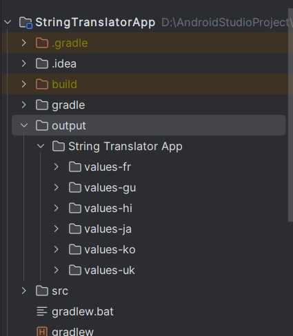

9. **Open Android Studio Project and paste all values folder in an Src Folder using Explorer.**

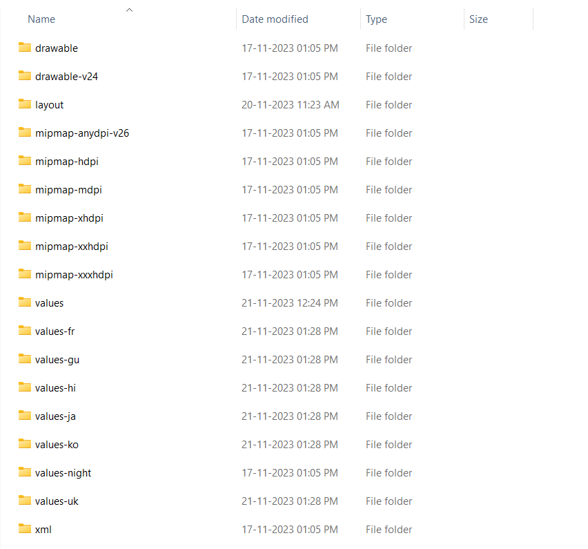

10. **All translated strings successfully imported.**

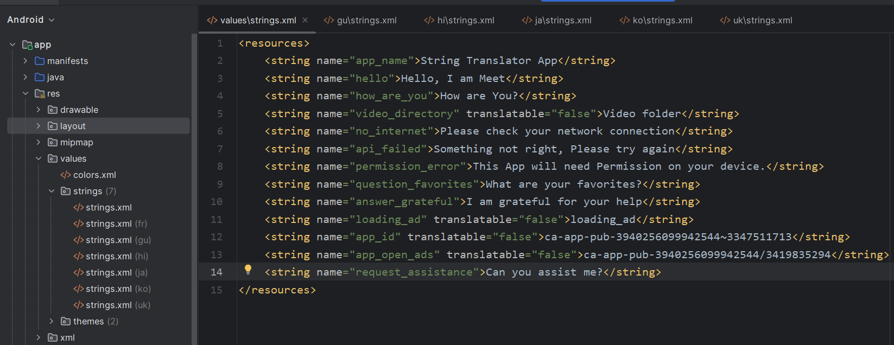
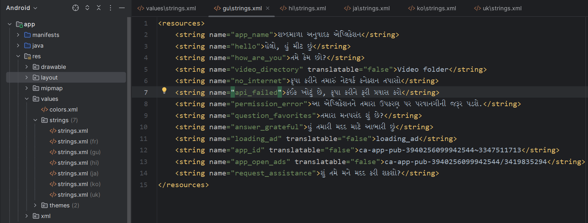
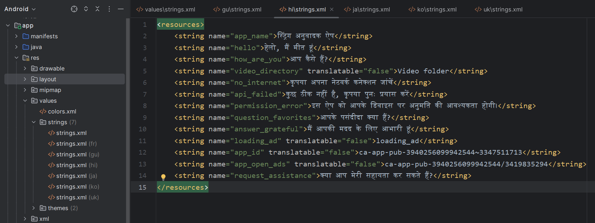

## Contributing 🤝

Join us in shaping the future of this project – your contributions are invaluable!

1. **Fork the repository** and create a new branch for your feature or bug fix.
2. Select an existing issue or create a new one, and request that it be assigned.
3. If the issue is assigned, make your changes and ensure that the code follows the project's coding standards.
4. Write tests to cover your changes and ensure that existing tests pass.
5. Submit a **pull request**, explaining the changes and the problem it addresses.
6. A project maintainer will review your pull request. Please be patient during the review process.
7. Upon approval, your changes will be merged into the main branch.
Thank you for your contribution! 🚀

## Author

**Meet**

If you appreciate my work, consider following me on LinkedIn, YouTube, and adding this project to your favorites on GitHub. Stay tuned for more insights into app development, Kotlin, and more!
